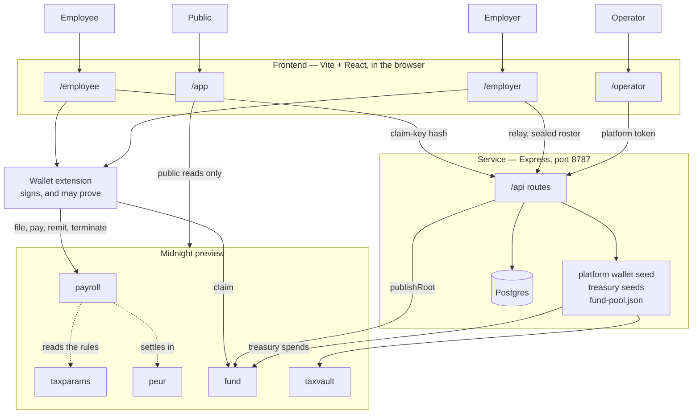

# IncomeLayerZK

**Private payroll on Midnight, and an unemployment benefit paid out of it
without anyone learning who claimed or how much.**

An employer files a month's payroll. The chain learns the headcount, the totals
and one sealed commitment per person — never a salary. Tax and social
contributions are computed *inside the circuit* from published rules, so an
employer cannot choose a rate. When somebody's employment ends, they can later
prove they qualify for a benefit and collect it, while remaining
indistinguishable from everyone else terminated that month across every employer
on the platform.

Nobody is recorded as unemployed anywhere. There is no claimant list, no status
field, and nothing an observer can enumerate to find one.

## Live on Midnight preview

| | |
| --- | --- |
| Payroll | `fac350489f46c3cc1893c18af83cac7e18b1f5bde34c452dfa8eb71b0a3e5938` |
| Settlement asset (pEUR) | `eefd3c255ed64dce05cd8c9b357b95aae94be6aef6ad009069af7836af481d91` |
| Tax rules | `7feb657fb4a0541e3308d8fb14eca4538e6343d16f0a7540b620ed7547492910` |
| Benefit fund | `f8e9e69a15eb3074fd851235bc4d851bffd223113e723fd5915703fc7ca47106` |
| Tax vault | `8fd9f343910c8e96028279c1e560524af32753ea18c594e91844ec8b3941ecc1` |

Two payroll periods have been filed, funded, paid and remitted end to end, and a
benefit has been claimed against the fund — from the browser, with the salaries
never leaving the employer's machine. The transaction hashes are in
[docs/findings.md](docs/findings.md).

## The five contracts

| Contract | Instances | Holds money | What it is for |
| --- | --- | --- | --- |
| **`payroll`** | one per employer | net pay, briefly | Files a period: headcount, totals, one commitment per employee. Holds withheld tax and contributions until remitted, and records the employer's write-once attestation that someone's employment ended. |
| **`taxparams`** | one, shared | no | The versioned, append-only record of what the rates were, so a filing stays checkable against the rules in force when it was made. |
| **`peur`** | one, shared | — | A shielded EUR stablecoin payroll is denominated in. Balances and transfer amounts are private; total supply is public so it can be audited against reserves. |
| **`fund`** | one, shared | yes | The money benefits are paid from, and the per-period Merkle roots a claim proves membership of. |
| **`taxvault`** | one, shared | yes | Receives wage tax under a withdrawal authority frozen at deploy. Unlike the fund it never pays out privately, so its balance *is* public. |

## Architecture



The dotted lines are reads, not calls: `payroll` looks up the rule set in force
for a period, and settles in `peur`. Everything else is a transaction.

**Who touches what, and why it is split that way:**

| Actor | Uses | Signs with | Needs the service? |
| --- | --- | --- | --- |
| **Public** | `/app` | — | no — every figure is a public chain read |
| **Employee** | `/employee` | own wallet | only to publish a claim-key hash |
| **Employer** | `/employer` | own wallet | for the relay and the sealed roster |
| **Operator** | `/operator` | platform wallet, held by the service | yes — it holds the seeds |

The service exists for exactly three things a browser cannot do: hold the
**platform wallet's seed**, hold the **two treasury seeds**, and read
**`fund-pool.json`** — the only record of the fund's coin nonces anywhere. It is
not a backend in the usual sense: it never sees a salary, and the payroll
workbook never leaves the employer's machine.

The database holds three tables and can read only one of them meaningfully.
`registrations` is bookkeeping; `claim_key_hashes` is inert public data;
`sealed_rosters` is ciphertext under the employer's payroll passphrase, which the
service never receives.

## How a month works

```
EMPLOYER                          CHAIN                        EMPLOYEE
--------                          -----                        --------
workbook (salaries)  ──file──▶   totals + commitments
                     ──pay───▶   net as shielded coins  ──────▶ wallet
                     ──remit─▶   pools → treasury wallets       payslip (out of band)

OPERATOR
--------
treasury wallets     ──────────▶ benefit fund + tax vault
```

Filing, paying and remitting are one action in the UI and three signatures on
chain. The waits between them are forced by the ledger, not by the interface:
paying spends coins that funding just created, and a coin cannot be spent until
its commitment has a position in the Zswap tree.

## How a claim works

An employee creates a **claim key** while still employed and sends its *hash* to
their employer. When employment ends, the employer signs a write-once attestation
containing that hash. A relay folds every termination for the month into one
Merkle tree and publishes the root.

To claim, she proves — in zero knowledge — that she holds the key behind a leaf
in that tree, that she worked long enough, and what her final salary was. The
chain learns the period, that *a* claim happened, and one opaque nullifier. Not
who, not which employer, not how much.

The anonymity set is everyone terminated in the same month, platform-wide. That
is the design, and it is why the fund is one shared contract rather than one per
employer.

## Documentation

| | |
| --- | --- |
| [Contracts](docs/contracts.md) | `payroll`, `taxparams`, `peur` — what each stores and refuses |
| [The benefit](docs/benefit.md) | the fund, terminations, the claim tree, claiming |
| [Privacy](docs/privacy.md) | the disclosure boundary, proving, what is still custodial |
| [Frontend](docs/frontend.md) | four areas, one per party, and the design system |
| [The service](docs/service.md) | routes, rate limits, and what the database holds |
| [Walkthroughs](docs/walkthroughs.md) | what an employer does, what an employee does |
| [Operations](docs/operations.md) | funding, paying, networks, reading errors |
| [Deployment](docs/deployment.md) | Render and Vercel, and the variables each needs |
| [Running locally](docs/running-locally.md) | devnet, proof server, scripts, toolchain |
| [Findings](docs/findings.md) | what was verified on chain, and the probes behind the design |
| [Status](docs/status.md) | where it stands, known sharp edges, what is not built |

**Start with [Status](docs/status.md#known-sharp-edges) before changing
anything.** It lists the traps that cost the most time — silent Bech32m/hex
mismatches, two installs of the same runtime breaking `instanceof`, and a
deployment record that outranks the environment.

## A note on the name

The product is **IncomeLayerZK**. The repository and the `polisZK/...`
domain-separation tags keep the older name and **must not be renamed** — they
derive keys and commitments, so changing either invalidates every commitment
already on chain.

## Project structure

```
midnight-polisZK/
├── compose.yml                    # local devnet: node + indexer
├── contracts/
│   ├── payroll.compact            # private salaries, public aggregate, terminations
│   ├── taxparams.compact          # versioned, append-only tax rules
│   ├── peur.compact               # shielded stablecoin
│   ├── fund.compact               # unemployment fund: rules, roots, nullifiers, pool
│   ├── taxvault.compact           # wage tax, under a frozen withdrawal authority
│   └── managed/                   # compiled artifacts, per contract (gitignored)
├── src/
│   ├── deploy.ts                  # deploys whichever CONTRACT_NAME names
│   ├── payroll-cli.ts             # payroll CLI
│   ├── peur-cli.ts                # pEUR CLI
│   ├── fund-cli.ts                # fund: status, params, deposit, pool, reconcile
│   ├── terminate-cli.ts           # end employment (CLI route)
│   ├── relay.ts                   # build + publish a period's claim tree
│   ├── check-balance.ts           # address + tNIGHT/tDUST
│   ├── server/                    # the platform service (Express)
│   │   ├── app.ts                 # routes: onboard, relay, claim-keys, sealed-roster, platform/*
│   │   ├── config.ts              # host/port/token rules, the two rate-limit buckets
│   │   └── guards.ts              # rate limiting, platform token, signup code
│   ├── providers/                 # midnight-js provider wiring
│   └── utils/
│       ├── benefit-params.ts      # the published rule sets — only their HASH is on chain
│       ├── claim-tree.ts          # the tree, hashed by the contract's own pure circuits
│       ├── fund-pool.ts           # coin nonces + change-nonce derivation
│       ├── peur.ts                # the pEUR token id, read off the contract
│       └── …                      # network config, wallet, contract, deployments
├── frontend/                      # wallet-connect UI (Vite + TypeScript)
│   ├── public/deployments.json    # generated by npm run frontend:config
│   └── src/
│       ├── wallet/WalletContext.tsx   # connect, account snapshot, refresh
│       ├── pages/                     # Public, Operator, EmployerPayroll/Employees/
│       │                              #   History/Settings, Employee, EmployeeBenefit
│       ├── components/                # DashHero, ClaimForm, ClaimKey, EndEmployment,
│       │                              #   EmployerTable, FundDeposit, NationalTotals, …
│       └── lib/                       # claim.ts, claimKey.ts, runMonth.ts, sealedRoster.ts,
│                                      #   publishedClaimKeys.ts, useRunGuard.ts, …
├── terminations/                  # employers' termination openings — input to the relay
├── claims/<period>/               # claim bundles the relay writes, one per claimant
├── .env                           # config (keep private!)
├── deployment.json                # addresses, keyed <network>/<contract>[:instance]
├── fund-pool.json                 # ⚠️ the ONLY copy of the fund's coin nonces (gitignored)
├── .wallet-state/                 # cached sync state (gitignored, 0600)
└── payroll-secrets.*.json         # local cache of openings, rebuildable from chain (gitignored, 0600)
```

## License

This project is licensed under the Apache License, Version 2.0.

See [LICENSE](./LICENSE) for details, and [NOTICE](./NOTICE) for attribution.

Original source files carry a short SPDX header:

```
// Copyright 2026 Henk Wim de Boer
// SPDX-License-Identifier: Apache-2.0
```

Applied to `contracts/*.compact`, `src/**`, and `frontend/src/**` — **excluding
`frontend/src/generated/`**, which is copied from the Compact compiler's output
by `npm run frontend:config` and is not original work. Third-party dependencies
keep their own licenses.
